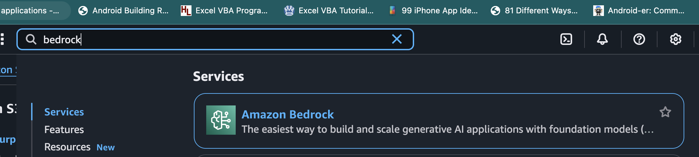
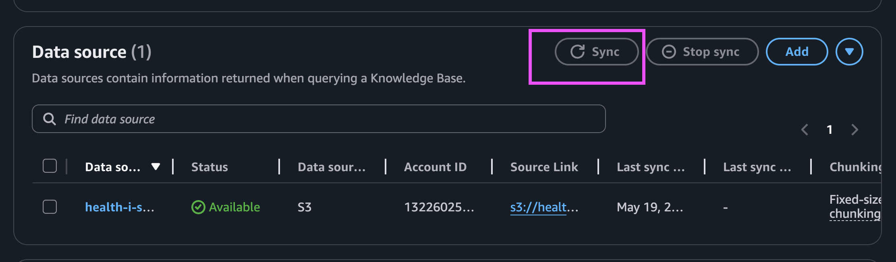

# Upload Health files to S3 and Sync with Knowledge base

To test this application, we'll use the `MIMIC-III Clinical Database` records
available through the AWS Open Data Sponsorship Program.

`MIMIC-III Clinical Database` contains de-identified health data associated with
over forty thousand patients.

Please download the records from the link below

```
https://physionet.org/content/mimic-iv-demo/2.2/

```

The files are zipped, you'll have to unzip them.

We'll be upload these records to an S3 table, then triggering a `Sync` function
in our knowledge base on the AWS Console.

The knowledge base will break the csv files into chunks, convert these chunks
into embeddings using the `Amazon titan embeddings` v2 foundation model and then
save the embeddings to the `pinecone` database index we created.

Assuming you've downloaded the files, navigate to S3 on the AWS Console.

Search for the bucket with name starting with `healthaicdkstack-healthai......`.

Open it up and drop all csv files into it.

Once you're done, search for `bedrock` in the AWS Console, open it up and
navigate to the knowledge base with name `HealthAIknowledgeBase`.




